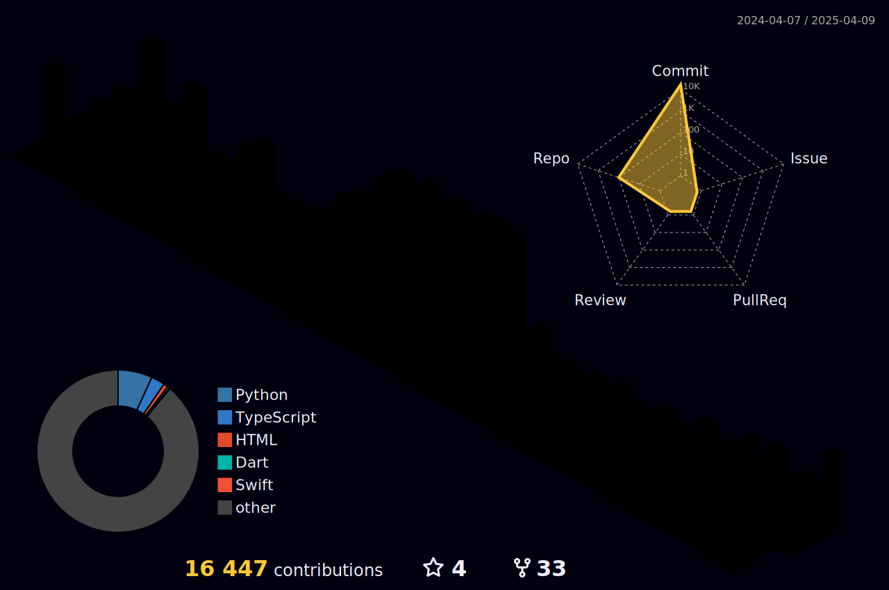

<picture>
  <source media="(prefers-color-scheme: dark)" srcset="https://raw.githubusercontent.com/wenhaofree/wenhaofree/output/github-contribution-grid-snake-dark.svg">
  <source media="(prefers-color-scheme: light)" srcset="https://raw.githubusercontent.com/wenhaofree/wenhaofree/output/github-contribution-grid-snake.svg">
  
</picture>

<!--

-->

## Hi there 👋
This is the place where I opensource stuff and break things 🤣

🔭  I’m currently working on something cool 😉 

🌱  I’m currently learning Rust

💬  Ask me about anything related to JavaScript/TypeScript or Vue

👨‍💻  Read more about my projects at wenhaofree.com

⚡  Fun fact: I want to raise a cat 🐈

<!--
**wenhaofree/wenhaofree** is a ✨ _special_ ✨ repository because its `README.md` (this file) appears on your GitHub profile.

Here are some ideas to get you started:

- 🔭 I’m currently working on ...
- 🌱 I’m currently learning ...
- 👯 I’m looking to collaborate on ...
- 🤔 I’m looking for help with ...
- 💬 Ask me about ...
- 📫 How to reach me: ...
- 😄 Pronouns: ...
- ⚡ Fun fact: ...
-->
