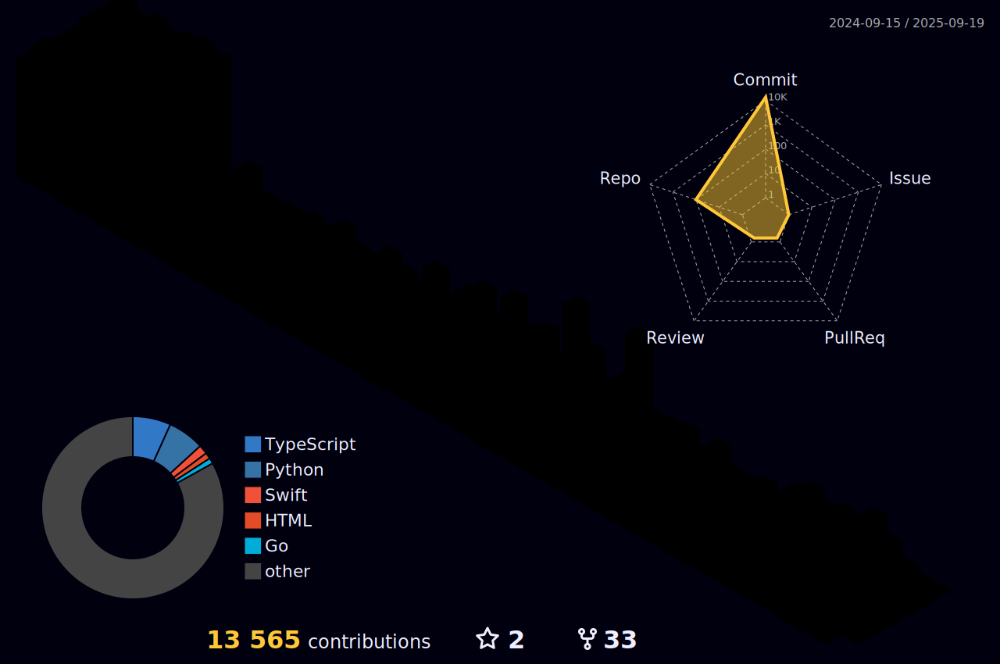

<!--

-->

## Hi there 👋

This is the place where I opensource stuff and break things 🤣

  🔭 **Currently Working On**: Some exciting full-stack development projects.
  
  🌱 **Learning**: Enhancing my skills in both backend and frontend technologies.
  
  💬 **Ask Me About**:
  
  * Programming Languages: Java, Python, Go
  * Web Technologies: Node.js, Next.js, React
  * Databases: MySQL, PostgreSQL, Redis, MongoDB
  * Frameworks: Spring Boot
  
  👨‍💻 **Projects**: Check out my open-source contributions and personal projects at [wenhaofree.com](http://wenhaofree.com).
  
  ⚡ **Fun Fact**: I’m on a mission to raise a cat 🐱 and build some awesome things with them!

<picture>
  <source media="(prefers-color-scheme: dark)" srcset="https://raw.githubusercontent.com/wenhaofree/wenhaofree/output/github-contribution-grid-snake-dark.svg">
  <source media="(prefers-color-scheme: light)" srcset="https://raw.githubusercontent.com/wenhaofree/wenhaofree/output/github-contribution-grid-snake.svg">
  
</picture>

<!--
**wenhaofree/wenhaofree** is a ✨ _special_ ✨ repository because its `README.md` (this file) appears on your GitHub profile.

Here are some ideas to get you started:

- 🔭 I’m currently working on ...
- 🌱 I’m currently learning ...
- 👯 I’m looking to collaborate on ...
- 🤔 I’m looking for help with ...
- 💬 Ask me about ...
- 📫 How to reach me: ...
- 😄 Pronouns: ...
- ⚡ Fun fact: ...
-->
